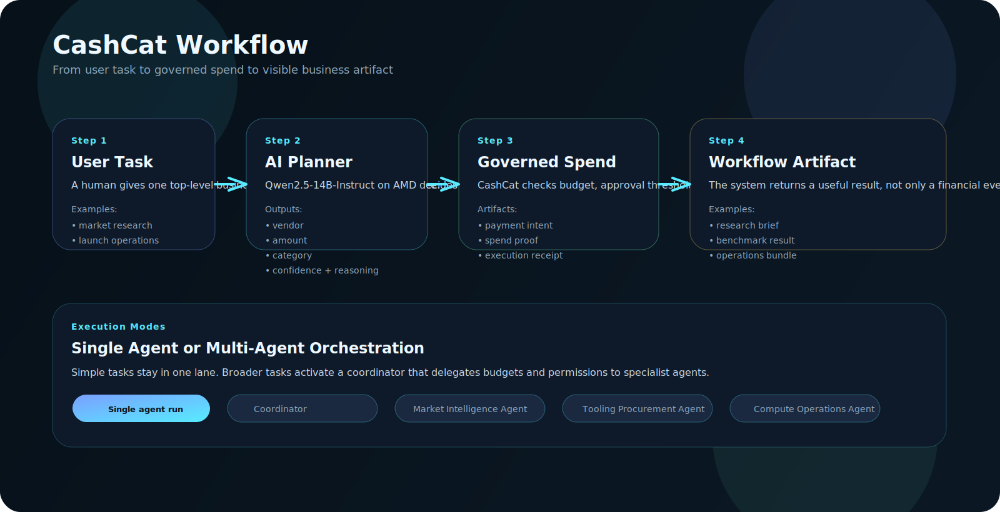

# CashCat

CashCat is an **AI Agent Payment OS** for automating and governing economic actions by AI agents.

Agents can request paid resources such as APIs, data, software, compute, and services. CashCat turns those requests into bounded payment workflows with budgets, approvals, payment intents, receipts, spend proofs, and audit trails.

This repository is a public-safe project repo for hackathon and build-week review. It contains the product demo, architecture, workflow diagrams, schemas, examples, and selected implementation excerpts without production credentials or private commercialization details.

## OpenAI Build Week

This version of CashCat is prepared for **OpenAI Build Week**.

The project focuses on a practical question:

> If AI agents are going to act for users and teams, how should they pay for things safely?

CashCat's answer is to separate the AI's planning role from the financial authority layer:

- The agent decides what paid resources are needed.
- CashCat grants bounded authority, routes approvals, and records proof.
- Existing payment rails such as Stripe, PayPal, cards, wallets, or crypto infrastructure can execute value movement underneath.

## How Codex Helped

OpenAI Codex was used as a build partner across the repository, especially for turning the idea into a reviewable product artifact.

Codex helped with:

- Product shaping: refined CashCat from a narrow API/data-purchase demo into an AI Agent Payment OS.
- Frontend iteration: built and adjusted the public demo pages, task input flow, agent run timeline, proof display, and GitHub Pages deployment.
- Architecture documentation: produced diagrams, workflow docs, AI runtime notes, schemas, and public-safe examples.
- Repository hygiene: separated the public hackathon repo from the private local project, removed sensitive materials from the public repo, and added proprietary rights notices.
- Presentation support: generated slide assets, Q&A prep material, and OpenAI Build Week versions of the deck imagery.

Codex was not used as a replacement for product judgment. It acted as an implementation and documentation accelerator while the core product direction remained focused on safe agent payments, automation, and financial control.

## Architecture

## Workflow

## Rights

- Copyright: CashCat project authors
- License status: proprietary, all rights reserved
- Public visibility does not grant reuse rights without permission

## Track

- OpenAI Build Week
- AI Agents & Agentic Workflows

## What This Public Repo Includes

- A static product site for the hackathon submission
- A live-feeling product demo with AI task entry and governed spend outputs
- A multi-agent orchestration showcase page
- A proof page with payment intent, receipt, spend proof, and workflow artifacts
- AI architecture, schemas, and example input/output chains
- Submission-safe examples, docs, and selected source excerpts

## What The Demo Shows

- A user gives an AI agent a business task
- The AI proposes paid actions such as data, software, API, or compute purchases
- CashCat governs budget, approvals, and spend permissions
- The workflow returns evidence such as payment intent, receipt, spend proof, and downstream artifacts

## AI Runtime

- Model used: `Qwen2.5-14B-Instruct`
- Provider: `AMD vLLM endpoint`
- Planner role: translate natural-language tasks into structured spend proposals
- Control role: CashCat applies budget, approval, and spend-permission logic before producing governed artifacts

## Product Shape

CashCat is not just an API and not a payment processor.

It has three product surfaces:

- Web workspace: a ChatGPT-like task entry point where a user gives an agent a business task and reviews spend proposals, approvals, receipts, and proofs.
- Developer API: an integration layer for agent builders who want to call CashCat before an agent initiates a paid action.
- Enterprise control console: a management layer for budgets, permissions, approvals, policy controls, audit trails, and payment rail configuration.

## Public Site Entry Points

- [index.html](./index.html): primary product page
- [live-demo.html](./live-demo.html): explicit multi-agent orchestration showcase
- [proof-demo.html](./proof-demo.html): proof-oriented payment flow page
- [api.html](./api.html): public integration reference

## Supporting Materials

- [docs/ARCHITECTURE_OVERVIEW.md](./docs/ARCHITECTURE_OVERVIEW.md): visual architecture diagram and system summary
- [docs/workflow-diagram.svg](./docs/workflow-diagram.svg): end-to-end workflow diagram
- [docs/AI_ARCHITECTURE.md](./docs/AI_ARCHITECTURE.md): task, planner, governance, and orchestration design
- [docs/DEPLOYMENT.md](./docs/DEPLOYMENT.md): GitHub Pages + public API deployment model
- [docs/first-wedge-demo-flow.md](./docs/first-wedge-demo-flow.md): public-safe walkthrough of the first wedge
- [examples/first-wedge-demo-request.json](./examples/first-wedge-demo-request.json): sample request payload
- [examples/first-wedge-demo-output-sanitized.json](./examples/first-wedge-demo-output-sanitized.json): redacted output example
- [examples/research-agent-task.json](./examples/research-agent-task.json): single-agent task input
- [examples/research-planner-output.json](./examples/research-planner-output.json): planner output for a research workflow
- [examples/research-governed-result.json](./examples/research-governed-result.json): governed spend result for the same task
- [examples/research-workflow-artifact.json](./examples/research-workflow-artifact.json): downstream artifact returned after the governed run
- [examples/operations-agent-task.json](./examples/operations-agent-task.json): broader operations task input
- [examples/operations-planner-output.json](./examples/operations-planner-output.json): planner output for operations workflow
- [examples/operations-governed-result.json](./examples/operations-governed-result.json): governed spend result for operations workflow
- [examples/operations-workflow-artifact.json](./examples/operations-workflow-artifact.json): downstream operations artifact
- [schemas/agent-task.schema.json](./schemas/agent-task.schema.json): task input schema
- [schemas/payment-plan.schema.json](./schemas/payment-plan.schema.json): structured AI planner output schema
- [schemas/workflow-result.schema.json](./schemas/workflow-result.schema.json): downstream artifact schema
- [showcase/README.md](./showcase/README.md): selected code excerpts from the private implementation
- [showcase/AI_RUNTIME_DESIGN.md](./showcase/AI_RUNTIME_DESIGN.md): public-safe AI runtime design notes
- [showcase/pseudocode/agent-planner-schema.ts](./showcase/pseudocode/agent-planner-schema.ts): planner prompt and output shape
- [showcase/pseudocode/orchestration-decision.ts](./showcase/pseudocode/orchestration-decision.ts): single-agent vs orchestration routing logic
- [LICENSE](./LICENSE): repository rights statement
- [NOTICE.md](./NOTICE.md): plain-language usage notice

## Public Scope

Included:

- Product summary
- Demo pages
- Public-safe docs and examples
- Presentation assets
- Selected code excerpts for reviewer inspection

Excluded:

- Production credentials
- Proprietary payment routing logic
- Internal risk heuristics
- Partner integrations
- Private roadmap and commercialization details

## Repository Strategy

- Use this repository as the public hackathon submission shell.
- Only copy in sanitized assets and submission-safe code.
