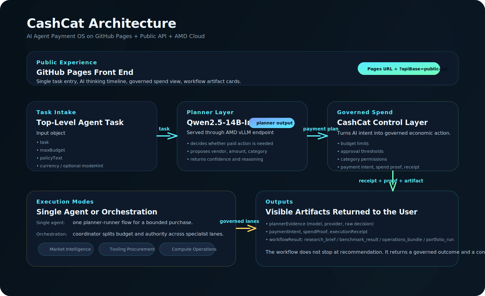

# Architecture Overview

## Summary

CashCat is split into three visible layers:

1. `GitHub Pages front end`
2. `Public API layer`
3. `AMD-backed planner and governed spend runtime`

## Front End

The product site is served as static pages. It provides:

- one task entry point
- thinking timeline
- governed spend controls
- output artifacts

The front end can either:

- call a public API through `apiBase`
- or fall back to the embedded public demo runtime

## Public API

The repo includes a lightweight public API service:

- `/health`
- `/api/agent-payment-flow`
- `/api/multi-agent-flow`
- `/api/proof-flow`

This gives the public site a realistic remote execution path instead of only a static simulation.

## Planner + Control Layer

The planner role is modeled as:

- `Qwen2.5-14B-Instruct`
- served via `AMD vLLM endpoint`

CashCat then governs the planner output through:

- budget rules
- approval thresholds
- category permissions
- proof and receipt generation

## Single Agent vs Orchestration

Simple tasks stay in a single-agent path.

Broader tasks activate orchestration:

- coordinator agent
- market intelligence lane
- tooling procurement lane
- compute operations lane

The final result is a governed workflow artifact, not just a payment event.
